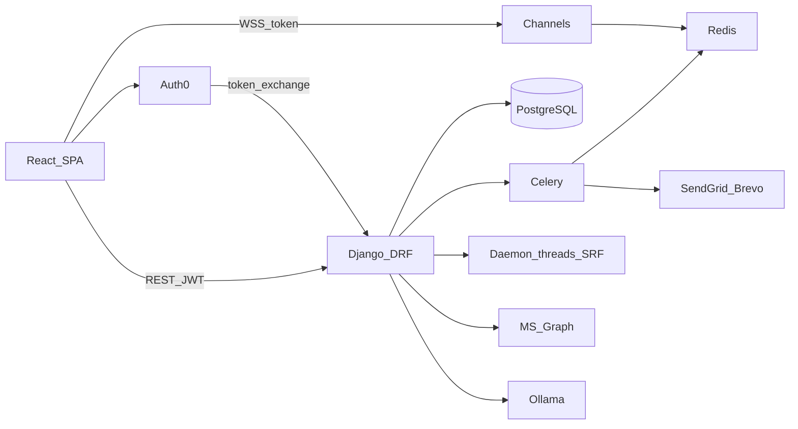

# Dossier d’analyse technique PFE — Digital Talent Center

**Projet analysé :** `pfe-talent-center`  
**Date d’analyse :** 2026-09-02  
**Règle de preuve :** `[PROUVÉ]` / `[INFÉRENCE]` / `[NON TROUVÉ]`  
**Hors périmètre inventé :** BaseConnector, matchOn, timebreaker, newest_wins multi-sources, Redis Streams, BullMQ, multi-tenant DB — absents du code.

---

# PARTIE A — Compréhension globale du projet

## 1. Finalité globale

[PROUVÉ] Digital Talent Center est une plateforme web mono-organisation pour la gestion du parcours étudiant autour des **stages / PFE**, de la **conformité financière (SRF)**, de la **supervision (encadrants)**, des **documents**, de la **communication** (chat, notifications, annonces) et d’**assistants IA** (CV, career coach, profile intelligence).

Preuves : montage API dans `backend/core/urls.py` ; features frontend `admin`, `student`, `Encadrant`, `cv`, `cv_builder`, `auth`.

## 2. Problème métier / technique

[INFÉRENCE à partir du code métier] Le système cherche à unifier, pour une école / centre :

- publication et matching d’offres de stage ;
- candidatures avec cycle de vie contrôlé ;
- suivi financier et conformité (import ERP → comptes étudiants) ;
- coordination encadrant / étudiant (agenda, meetings, rapports) ;
- authentification mixte (local + Auth0 / Microsoft) avec contrôle d’accès plateforme distinct du SSO ;
- assistance IA locale (Ollama) à coût maîtrisé.

Ce n’est **pas** un iPaaS de synchronisation multi-SGBD.

## 3. Principaux composants

| Composant | Rôle | Preuve |
|-----------|------|--------|
| SPA React/Vite | UI multi-rôles | `frontend/` |
| API Django/DRF | logique métier + REST | `backend/apps/*`, `core/urls.py` |
| PostgreSQL | persistance unique | `core/settings.py` DATABASES |
| Redis (optionnel) | cache, Celery, Channels | `settings.py` L360–404 |
| Celery | tâches asynchrones | `core/celery.py` |
| Channels/Daphne | WebSockets | `core/asgi.py` |
| RAG PostgreSQL | vecteurs coach (`RagChunk`) | `career_coach.models` |
| Auth0 | broker login SPA | `@auth0/auth0-react`, exchange API |
| Microsoft Graph | grant/revoke Enterprise App | `apps/integrations/microsoft_graph/` |
| Ollama / OpenAI | LLM / matching | settings + providers |

## 4. Utilisateurs et systèmes externes

**Personas [PROUVÉ]** (`accounts_et_roles.models.User.RoleChoices`) : `STUDENT`, `STAFF`, `SUPERVISOR`, `ADMIN`.

**Externes [PROUVÉ]** : Auth0, Microsoft Entra/Graph, SendGrid/Brevo (email), Ollama, OpenAI (optionnel matching/CV), Jitsi (réunions FE), sites d’offres (LinkedIn, ReKrute… via fetch HTML).

## 5. Flux principaux

1. Login (local / Auth0 exchange) → JWT + `LoginSession` → accès zones UI selon rôle / onboarding.
2. Admin publie offres (manuel ou import URL) → matching → étudiants candidatent → transitions d’état → pipeline Kanban.
3. Admin importe fichier financier SRF → mapping → validation → exécution async → snapshots / rollback.
4. Admin accorde accès plateforme → sync Graph (si configuré).
5. Encadrant / étudiant : agenda (détection conflits), chat WS, rapports, documents.
6. Étudiant : CV builder, CV intelligence, career coach RAG.

## 6–7. Responsabilités et communications

Voir Parties C et D. Communication dominante : **HTTPS REST JSON** (Axios Bearer) et **WSS** (JWT en query string).

## 8. Données manipulées

Utilisateurs/profils, structure académique, offres/candidatures/entreprises, comptes financiers/installments/imports, documents, événements calendrier, messages chat, notifications, historique, embeddings CV/offres, sessions auth.

## 9. Opérations les plus complexes

[PROUVÉ] Import SRF (mapping + snapshots + rollback) ; sync Graph avec compensation ; machine à états candidatures ; conflits agenda + récurrence ; pipeline notifications (idempotence + claim) ; RAG career coach ; import offres multi-parsers + dédup.

## 10. Pourquoi ≠ CRUD simple

Machines à états, providers d’auth registry, permissions effectives, pipelines d’import avec audit/rollback, intégration IdP cloud, traitement async, détection de conflits calendrier, RAG + hashing CV, idempotence notifications.

## Synthèse A

```
PROBLÈME  → Fragmentation des processus stage / finance / supervision / identité
BESOINS   → Une plateforme unifiée multi-rôles, sécurisée, intégrable SSO + ERP + IA
SOLUTION  → Monolithe modulaire Django + SPA React, Postgres, Celery/Channels, Graph, Ollama
ARCHITECTURE → Apps métier + services domaine + RBAC + jobs async + WS
MÉCANISMES → State machines, mapping SRF, dédup, Graph compensation, RAG, idempotence
RÉSULTATS → Plateforme déployable Railway/Vercel (mesures perf : Non mesuré)
```

---

# PARTIE B — Cartographie technique

## Frontend

| Élément | Réalité | Preuve |
|---------|---------|--------|
| Framework | React 18 + TypeScript + Vite 6 | `frontend/package.json` |
| Structure | `src/app`, `features/{admin,auth,student,Encadrant,cv,cv_builder,shared}`, `design-system`, `i18n` | arborescence |
| Routing | react-router-dom | `app/router/` |
| État | Context React + localStorage (pas Redux/Zustand) | `AuthContext.tsx`, `client.ts` |
| Auth FE | Auth0 SPA + exchange JWT plateforme | `features/auth/` |
| Guards | AuthGuard, GuestGuard, OnboardingGuard, RouteAccessGuard, AuthLoadingGate | `app/router/guards/` |
| API | Axios `apiClient` Bearer + refresh single-flight 401 | `shared/api/client.ts` |
| UI | Tailwind, Framer Motion ; CV builder Svelte embarqué | package.json, `cv_builder/` |
| Tests FE | Pas de suite Vitest/Jest dédiée ; scripts `npm run check` | package.json |

## Backend

| Élément | Réalité | Preuve |
|---------|---------|--------|
| Framework | Django 4.2 + DRF | requirements.txt |
| Architecture | Monolithe modulaire (18 apps) | `apps/` |
| Controllers | DRF views/viewsets | `*/views*.py` |
| Services | Couche services forte par domaine | `*/services/` |
| Auth | SimpleJWT + SessionAwareJWTAuthentication | `authentication/authentication.py` |
| Providers | Registry LOCAL / Auth0 / Microsoft / SSO | `authentication/providers/` |
| Permissions | HasPermission, EffectiveHasPermission, rôles | `accounts_et_roles`, `admin_management` |
| Config | `core/settings.py` + `.env` | |

Apps : `accounts_et_roles`, `authentication`, `admin_management`, `stage`, `srf`, `announcements`, `documents`, `encadrant`, `agenda`, `chat`, `notifications`, `cv_builder`, `cv_intelligence`, `career_coach`, `profile_intelligence`, `history`, `settings_app`, `integrations`.

## Database

- [PROUVÉ] PostgreSQL obligatoire (`DATABASE_URL`, `psycopg2-binary`, `CONN_MAX_AGE=600`).
- Migrations Django (~86) sous `apps/*/migrations/`.
- [NON TROUVÉ] fichiers `.sql` applicatifs, Prisma, multi-schema tenants.

## Infrastructure

| Élément | Statut |
|---------|--------|
| Docker / Compose | [NON TROUVÉ] |
| Redis | Optionnel | 
| Celery workers | Présents (tâches autodécouvertes) |
| Reverse proxy NGINX | [NON TROUVÉ] dans le repo |
| CI/CD GitHub Actions | [NON TROUVÉ] |
| Deploy | Railway (backend Procfile gunicorn) + Vercel (frontend) |
| Monitoring dédié | [NON TROUVÉ] (logs Django / audit métier) |

## Services externes (rôle)

- **Auth0** : identité SPA → échange vers JWT Talent Center.
- **Microsoft Graph** : appRoleAssignments Enterprise App.
- **SendGrid/Brevo** : email notifications.
- **Ollama** : LLM local coach/CV.
- **OpenAI** : matching/embeddings optionnels.
- **Jitsi** : visioconférence côté FE.
- **Sites offres** : scraping/parse HTML (pas API officielles stables).

---

# PARTIE C — Architecture globale

## Vue d’ensemble

Monolithe backend + SPA + services auxiliaires (Redis/Celery/Ollama) + intégrations cloud.



## Communications (uniquement confirmées)

| SOURCE | PROTOCOLE | DESTINATION | DONNÉES | OBJECTIF |
|--------|-----------|-------------|---------|----------|
| SPA | HTTPS REST JSON | Django `/api/*` | Bearer JWT + body | Opérations métier |
| SPA | WSS `?token=` | Channels consumers | JWT access | Chat, notifs, agenda, coach |
| SPA Auth0 | OAuth/OIDC | Auth0 | tokens Auth0 | Login fédéré |
| SPA/Backend | HTTPS | `/api/auth/providers/auth0/exchange` | Auth0 → JWT plateforme | Liaison identité |
| Services | OAuth2 client-credentials | Microsoft Graph | tokens app | Grant/revoke accès Entra |
| Services | HTTP | Ollama / OpenAI | prompts / embeddings | IA |
| Celery | Redis broker | Workers | tâches JSON | Email, reminders, jobs |
| Import SRF | thread local | `process_import_batch` | batch_id | Exécution import |
| Channels | Redis channel layer | consumers | messages groupe | Fan-out temps réel |

---

# PARTIE D — Architecture logique

## Couches observées

| Couche | Rôle | Fichiers | Intérêt |
|--------|------|----------|---------|
| Presentation | UI React + guards | `frontend/src/**` | UX multi-rôles |
| API | URLs + views DRF | `*/urls.py`, `*/views*.py` | Contrat HTTP |
| Business/Service | règles métier | `*/services/**` | Isolation logique |
| Data access | ORM Django models | `*/models*.py` | Persistance |
| Security | authn/authz | `authentication/`, `permissions.py` | Contrôle d’accès |
| Integration/Adapter | Graph, parsers, email, AI providers | `integrations/`, `stage/services/import_*`, `notifications` | Extensibilité externe |
| Worker | Celery + threads | `*/jobs/`, `srf/.../runner.py` | Async |
| Infrastructure | settings, asgi, celery | `core/` | Wiring |

[NON TROUVÉ] Clean Architecture / hexagonal stricts (pas de ports/adapters formalisés partout).  
[PROUVÉ] **Monolithe modulaire layered** + **service pattern** + **registry pattern** (auth providers) + **strategy** (parsers offres) + **state machine** (applications).

### Patterns démontrés

1. **Registry** — `authentication/providers/registry.py` + `get_provider()` ; `perform_login` provider-agnostique (`auth.py` L1–7, L60–63).
2. **Service layer** — ex. `stage/services/*`, `srf/services/financial_import/*` (views minces).
3. **Strategy / interface parsers** — `OfferParserInterface`, `LinkedInParser`, `ReKruteParser` (`import_parsers.py`).
4. **State machine** — `APPLICATION_TRANSITIONS` (`application_lifecycle.py` L14–50).
5. **Compensation / saga légère** — Graph assign puis rollback si DB échoue (`sync.py` L107–119).

---

# PARTIE E — Intégrations et adapters (remplace « connectors »)

## [NON TROUVÉ] plateforme connectors

BaseConnector, ConnectorRegistry, MySQL/SQL Server/Odoo/MQTT/OPC UA/OData génériques : **absents**.

## Intégrations réelles

### 1. Microsoft Graph (Entra)

- **Rôle :** synchroniser l’affectation Enterprise App avec `platform_access_granted`.
- **Auth :** client-credentials (`MicrosoftGraphClient.get_access_token`).
- **Fichiers :** `apps/integrations/microsoft_graph/{client,service,sync}.py`.
- **Grant :** ensure user (invite guest) → assign appRole → grant local ; compensation unassign si DB échoue (`grant_microsoft_enterprise_access`, `sync.py` L79–119).
- **Revoke :** revoke local d’abord puis DELETE assignment.
- **Particularité :** Auth0 reste le broker login ; Graph ne gère que l’affectation.

### 2. Parsers d’offres (strategy)

- **Rôle :** extraire une offre depuis une URL.
- **Fichiers :** `stage/services/offer_import_service.py`, `import_parsers.py`, `import_html.py`.
- **Abstraction :** sélection de parser par plateforme sans réécrire le cycle import (`resolve_parser` / extraction → DTO → draft/publish).

### 3. Providers email

- SendGrid / Brevo / mock via config notifications (`EmailProviderConfig`).

### 4. Auth providers

- Registry LOCAL / Auth0 / Microsoft / SSO — même pipeline post-identité.

### 5. Webhooks stage (architecture préparée, livraison mock)

- Modèles `WebhookSubscription`, `WebhookEvent`, `WebhookDelivery`…
- `process_pending_webhook_deliveries` force succès mock (`webhook_service.py` L60–84).
- Point d’intégration documenté : HTTP POST + HMAC **non implémenté**.

### Comment étendre sans réécrire le « moteur » ?

[PROUVÉ pour auth et parsers] Ajouter un provider/parser conforme à l’interface + enregistrement registry/resolve.  
[NON TROUVÉ] moteur sync générique multi-sources unifié.

---

# PARTIE F — Pipelines de traitement (remplace sync engine)

Pas de cycle unique extract→map→conflict→write multi-DB. Quatre pipelines distincts :

## F.1 Import financier SRF

```
UPLOAD → PARSE → SUGGEST_MAPPING → PREVIEW/VALIDATE → QUEUE → PROCESS_CHUNKS
→ SNAPSHOT → APPLY → AUDIT → (ROLLBACK optionnel)
```

| Étape | Fichier / fonction | Entrée | Sortie / erreurs |
|-------|-------------------|--------|------------------|
| Upload | `SrfImportUploadView` + `validate_upload` / `parse_financial_file` | fichier ≤25 Mo | `FinancialImportBatch` + rows session |
| Mapping | `suggest_column_mapping` | headers | dict source→cible |
| Validation | `run_validation_pipeline` | mapping + rows | `validation_json`, `can_execute` |
| Enqueue | `enqueue_import_batch` | batch_id | thread daemon |
| Process | `process_import_batch` | batch | comptes/installments + snapshots |
| Rollback | `rollback_import_batch` | batch | restauration `before_state_json` |

**Mode :** asynchrone **thread-based** (pas Celery) — `runner.py` L12–36.  
**Risque :** perte si process Django redémarre ; rows en session expirables.

## F.2 Import offres URL

```
URL → VALIDATE/REACHABLE → OfferImportJob → FETCH/PARSE → NORMALIZE
→ DEDUP → PREVIEW → DRAFT ou PUBLISH
```

Fichiers : `offer_import_service.py`, parsers. Non-atomique volontairement (HTTP long).

## F.3 Sync accès Microsoft

```
TRIGGER admin access change → Graph ensure/assign|revoke → update local platform_access
```

Fichier : `sync.py` + bridge `admin_management/services/microsoft_access_sync.py`.

## F.4 Matching étudiant ↔ offre

Heuristique skills/type/éducation/localisation + pipeline embeddings optionnel OpenAI (`matching_service.py`, `ai_pipeline/`). Sans clé → mock/fallback.

---

# PARTIE G — Mapping et déduplication

## G.1 Mapping SRF

**Pourquoi :** fichiers ERP (CSV/XLSX/JSON) ont des en-têtes hétérogènes ; le modèle cible est fixe (`TARGET_FIELDS`).

**Stockage :** `FinancialImportBatch.column_mapping_json` + profils `FinancialImportMappingProfile`.

**Création :** suggestion auto via `COLUMN_ALIASES` + normalisation headers (`column_mapping.py` L32–100) ; ajustement manuel API preview.

**Application :** `apply_mapping_to_row` → validation → engine.

**Exemple [PROUVÉ] :** header `numéro_étudiant` → normalize → alias `student_number`.

**Types / absents :** validation pipeline (montants, résolution étudiant) ; colonnes non mappées ignorées côté cible.

## G.2 Déduplications réelles

### Offres

- Clé externe `(external_source, external_id)` ou fuzzy titre/entreprise (`detect_duplicate_offer`, `offer_service.py` L130–152).
- Import : `external_id_from_url` = SHA-256 URL normalisée ; similarité `difflib.SequenceMatcher` (`offer_import_service.py`).

### Notifications

- `NotificationEventDedup` + `check_idempotency` / `record_idempotency` TTL **24h** (`security_service.py` L14–33).
- Problème résolu : retries / double émission → un seul événement logique.

### CV

- `compute_cv_hash_*` (`cv_intelligence/services/cv_hash.py`) pour cache / éviter recomputes.

### Import SRF fichier

- `compute_sha256` sur fichier (`file_security.py`) ; détection doublons **dans le fichier** en validation.

[NON TROUVÉ] hash multi-source pour conflits d’enregistrement synchronisés.


# PARTIE H — Détection de conflits (agenda)

## Clarification
[NON TROUVÉ] Détection/résolution de conflits multi-sources type iPaaS (hashes record source vs local, policies `newest_wins`).
[PROUVÉ] Conflits de planification calendrier.

## Quand un conflit est-il créé ?
Lors de create/update d’événement, `find_conflicts` sonde les événements busy des users sur `[start_at, end_at)` (semi-ouvert). Le caller refuse si conflit bloquant et `allow_conflicts=False` (voir `agenda/services/events.py` + `conflicts.py`).

## Identification
Pas de matchOn : chevauchement temporel + appartenance organisateur/participant (non declined).

## Types
- Bloquants : `MEETING`, `EVALUATION`, `ADMINISTRATIVE`, `OUT_OF_OFFICE` (`BLOCKING_TYPES`, `conflicts.py` L28–33).
- Non bloquants : deadlines, milestones, reminders (signalés mais n’empêchent pas).
- All-day ignorés pour le busy time (L99–101).
- Récurrence : expansion via `expand_range`.

## Processus
1. Caller fournit `user_ids` + fenêtre.
2. Query events busy (organizer ou participant non declined).
3. Expand récurrence.
4. Construire liste `Conflict` (flag `blocking`).
5. Caller décide 409 / `allow_conflicts`.

## Faux conflits
Back-to-back 15:00/15:00 OK (semi-ouvert). Declined ≠ busy. All-day ≠ slot bloquant.

## Après « résolution »
Pas de table `Conflict` persistante : décision runtime. L’utilisateur replanifie ou passe `allow_conflicts`.

---

# PARTIE I — Résolution de conflits

## Agenda
Politique unique de facto : **refus des conflits bloquants** sauf opt-in `allow_conflicts`.
[NON TROUVÉ] `manual` / `newest_wins` / field-level / source wins / local wins pour sync de données.

## RECORD-LEVEL vs FIELD-LEVEL
Non applicable au sync multi-sources (absent). Pour l’agenda : résolution au niveau **événement / créneau**, pas de merge field-level.

---

# PARTIE J — MatchOn et Timebreaker

## MatchOn
[NON TROUVÉ] Aucun champ/config `matchOn` / `match_on`.

Analogies partielles (ne pas appeler « MatchOn » devant le jury sans préciser) :
- résolution étudiant SRF par `student_number` / email en validation ;
- dédup offres par `external_id` / titre+entreprise.

## Timebreaker
[NON TROUVÉ] Aucun mécanisme timebreaker / comparaison de timestamps pour `newest_wins` sync.

---

# PARTIE K — Isolation des données (remplace multi-tenancy DB)

## Verdict
[NON TROUVÉ] Multi-tenancy SaaS (`tenantId` → database/schema/pool).
[PROUVÉ] Une seule base Postgres ; isolation logique par **rôles, permissions, scopes, ownership**.

## Mécanismes
1. **Rôle primaire** `User.role` : `STUDENT` / `STAFF` / `SUPERVISOR` / `ADMIN` (`accounts_et_roles/models.py`).
2. **RBAC** `Permission` / `Role` / `UserRoleAssignment` ; `has_perm_code` / `permission_codes`.
3. **`platform_access_granted`** : SSO possible sans accès plateforme (`platform_access.py`, sync Graph).
4. **`AccessScope` / `UserScopeAssignment`** : modèle générique de frontières (peu utilisé opérationnellement).
5. **Admin scopes opérationnels** : `admin_management/services/scopes.py` (filières, class groups…).
6. **Visibility history** : filtrage student / supervisor / scoped admin.
7. **Tenant Entra** : `MICROSOFT_GRAPH_TENANT_ID` = tenant Azure, pas multi-tenant applicatif.

## Transmission
JWT `user_id` + session ; pas de header `X-Tenant-Id` applicatif. Middleware : standards Django + `HistoryRequestMiddleware` — pas de middleware tenant.

## Risques de fuite
- bugs de filtres queryset (dépendance à la couverture des permissions par vue) ;
- auth WS plus faible que HTTP (voir L) ;
- mode FE `VITE_FRONTEND_ONLY_ADMIN` : contournement UI (`AuthContext.tsx`, `RouteAccessGuard.tsx`) — dangereux si activé en prod.

## Scalabilité multi-org
[INFÉRENCE] Pour plusieurs écoles, il faudrait introduire un modèle Organization/Tenant — **non présent**.

---

# PARTIE L — Architecture de sécurité

| Problème | Solution | Implémentation | Protection |
|----------|----------|----------------|------------|
| Auth API | JWT HS256 SimpleJWT | `SIMPLE_JWT` + Bearer | Authn API |
| Révocation | `LoginSession` par access `jti` | `SessionAwareJWTAuthentication` L9–31 | Logout / revoke session HTTP |
| Multi-provider | Registry + `perform_login` | `auth.py` | Uniformité + lockout |
| Brute force | Lockout | `is_locked` / `record_attempt` | Rate login |
| Autorisation | RBAC codes + role guards | permissions DRF | Least privilege (selon couverture) |
| Accès plateforme | Flag séparé du SSO | `can_access_platform` | Invitation / grant explicite |
| Secrets | Variables d’environnement | `.env`, settings | Évite le hardcode |
| CORS/CSRF | Middleware Django | settings | Navigateur |
| Upload SRF | taille / extension / signatures | `file_security.py` | Fichiers dangereux |
| SQL injection | ORM Django | models/queries | Paramétrisation |
| Webhooks HMAC | Documenté mais mock | `webhook_service.py` L73 | **Non effectif** |
| WS | `AccessToken` en query | `chat/middleware.py` L29–35 | Authn plus faible que HTTP |
| Refresh `jti` | Revoke session | `refresh_session` L154–158 | **À vérifier** : sessions créées avec access `jti`, revoke utilise le `jti` du refresh |

S2S API tokens plateforme : [NON TROUVÉ] (hors client-credentials Graph sortant).

---

# PARTIE M — Architecture des données

## Modèles clés (par domaine)

### Identité / RBAC
`User`, profils, `Permission`, `Role`, `RolePermission`, `UserRoleAssignment`, `AccessScope`, `UserScopeAssignment`, invitations, logs de rôle/permission/statut.

### Auth
`LoginSession`, `LoginAttempt`, `PasswordResetRequest`, `SecurityEvent`, `StudentCredential`.

### Stage
`InternshipOffer`, `OfferApplication`, historiques, `OfferImportJob`, Company*, Interview*, `PipelineColumn`, Webhook*, `SemanticEmbedding`, …

### SRF
`FinancialAccount`, `Installment`, conformité/preuves ; import : `FinancialImportBatch`, `FinancialImportSnapshot`, `FinancialImportAuditEvent`, `FinancialImportMappingProfile`.

### Agenda / Chat / Notifs / History
`CalendarEvent`, participants ; Conversation/Message ; `NotificationEvent`, `NotificationEventDedup`, files ; `HistoryEvent`.

### IA
Modèles `career_coach` (dont `RagChunk`), `cv_intelligence`, `profile_intelligence`.

## Pourquoi cette structure
Domaines séparés par apps ; snapshots import → rollback ; history → audit transverse ; dédup notifications → idempotence ; embeddings → matching optionnel.

## Concurrence
- Notifications : `select_for_update(skip_locked=True)` — [PROUVÉ] `queue_service.py` L33.
- Import SRF : progress soft ; pas de lock distribué multi-worker.
- Candidatures : contrainte d’unicité active student/offer.
- Agenda : détection avant insert (race possible entre deux creates simultanés — limite).
- Snapshot compte : `paid_amount` compte capturé ; lignes installment sérialisées **sans** `paid_amount` d’installment (`engine.py` L27–40) — limite de fidélité au rollback des tranches.

---

# PARTIE N — Redis / Workers / Streams / Queues

## Redis
[PROUVÉ] Si `REDIS_URL` : cache Django, broker/result Celery, `RedisChannelLayer`. Sinon LocMem + `CELERY_TASK_ALWAYS_EAGER=True` + InMemoryChannelLayer (`settings.py` L360–404).

## Celery
`core/celery.py` : app `talent_center`, autodiscover. Tâches : notifications, agenda reminders, stage, cv_intelligence, profile_intelligence, announcements.

## Queues DB
- Notifications : enqueue + claim batch.
- Webhooks : deliveries PENDING (mock).
- SRF : **pas Redis** — thread daemon (`runner.py`).

## Redis Streams / BullMQ
[NON TROUVÉ]

## Worker down / idempotence
- Celery + Redis : messages broker ; retries selon tâche.
- Eager : synchrone dans le process web.
- Thread SRF : perte si crash process.
- Notifications : idempotence clé + TTL 24h [PROUVÉ].
- Chat : [NON TROUVÉ] clé client d’idempotence.
- Graph assign : idempotent côté service.

---

# PARTIE O — Architecture API (domaines importants)

Racine : `backend/core/urls.py`.

| Domaine | Préfixe | Importance |
|---------|---------|------------|
| Auth | `/api/auth/` | login, refresh, me, sessions, Auth0 exchange, providers |
| Accounts | `/api/` accounts | onboarding identité/profil |
| Admin | `/api/admin/` | RBAC, structure, students, MS access |
| Stage | `/api/` internship… | offres, applications, import, pipeline, webhooks |
| SRF | `/api/srf/` | dashboard, preuves, imports |
| Agenda | `/api/agenda/` | events, conflicts, availability |
| Chat | `/api/chat/` | conversations, messages |
| Notifications | `/api/notifications/` | feed, preferences, admin email |
| CV / IA | `/api/cv/`, `cv-intelligence/`, `career-coach/`, `profile-intelligence/` | |
| History | `/api/history/` | audit |
| Encadrant | `/api/encadrant/` | reports, meetings |
| Documents / Annonces | montés sous `/api/` | |

Authn : JWT session-aware (sauf login/providers publics). Authz : permissions DRF par vue.

---

# PARTIE P — Tests

## Inventaire [PROUVÉ]
- `authentication` : login local, sessions, passwords, me, providers, Auth0 exchange, envelope
- `agenda` : scheduling, récurrence, permissions, CRUD, integrations, **conflicts**
- `chat` : message workflow, inbox filtering, visibility
- `notifications` : engine, email architecture
- `cv_builder` / `cv_intelligence`
- `encadrant` meeting sessions
- `stage` : offer import regression
- `admin_management` : module permissions
- `microsoft_graph` : service tests

## Frontend
Scripts `npm run check` — pas de suite Vitest/Jest riche.

## Exemples
- Idempotence notifications : double `emit_event` même clé → un seul event (`security_service` + tests engine).
- Conflits agenda : deux MEETING chevauchants → refus sauf `allow_conflicts` (`tests/test_scheduling.py`).
- Auth sessions : revoke → HTTP AuthenticationFailed.
- matchOn / timebreaker / newest_wins : [NON TROUVÉ] (pas de tests car absents).

---

# PARTIE Q — Déploiement

## Confirmé
- Backend : `Procfile` → migrate + gunicorn `core.wsgi` ; Railway ; Postgres.
- Frontend : `vercel.json` build `frontend` → `dist`.
- Env : `backend/.env.example`, `frontend/.env.example`.

## Absent
Docker, Compose, NGINX dans le repo, GitHub Actions, config SSL applicative (chez l’hébergeur).

## Parcours
```
DEV (runserver + vite)
→ BUILD (npm run build)
→ DEPLOY Vercel (SPA) + Railway (Gunicorn + migrate)
→ RUNNING (Postgres ; Redis optionnel pour Celery/WS multi-process)
```

Performance chiffrée : **Non mesuré dans le projet.**

---

# PARTIE R — Complexité technique

### Complexité fonctionnelle
PROBLÈME → Parcours métier multiples (stage, finance, supervision, docs, IA) pour 4 personas.  
POURQUOI DIFFICILE → Règles croisées (platform access, onboarding, scopes, state machines).  
SOLUTION → Apps Django + permissions codes.  
IMPLÉMENTATION → `apps/*`, `EffectiveHasPermission`, guards FE.  
RISQUES → Vue sans permission = fuite.  
RÉSULTAT → Plateforme unifiée multi-modules.

### Complexité algorithmique
Matching offres, similarité import (`difflib`), conflits + récurrence, RAG retrieve.  
Implémentation : `matching_service`, `offer_import_service`, `conflicts.py`, RAG coach.  
Risques : qualité matching / HTML LinkedIn fragile. Chiffres : Non mesuré.

### Complexité architecturale
Intégrer multi-provider auth, async, WS, IA locale, Graph dans un monolithe modulaire.  
Risque : threads SRF vs Celery ; couplage inter-apps.

### Complexité des données
Import financier potentiellement destructif → snapshots + rollback + audit.  
Limite : sérialisation installment sans `paid_amount` de tranche (`engine.py` L27–40).

### Complexité de synchronisation
Aligner accès Talent Center ↔ Entra (grant/revoke + compensation).  
[NON TROUVÉ] sync bidirectionnelle delta Entra→app.

### Complexité de concurrence
Workers notifs (`skip_locked`), imports, double submit.  
Risques : race agenda ; thread SRF non distribué ; chat non idempotent.

### Complexité de sécurité
SSO ≠ accès métier ; révocation tokens ; uploads ; écart WS ; HMAC webhook mock ; flag FE admin-only.

### Complexité de scalabilité
WS/Celery multi-process via Redis ; sans Redis : eager/InMemory non horizontal. Non mesuré.

### Complexité d’intégration
Auth0, Graph, email, Ollama, sites offres — providers/adapters + flags env.

### Complexité de déploiement
FE/BE séparés Vercel/Railway ; pas de CI tests dans le repo ; worker Celery à provisionner explicitement si Redis.

---

# PARTIE S — Diagrammes recommandés

1. **Architecture générale** — SPA, API, PG, Redis, Celery, Graph, Auth0, Ollama.
2. **Architecture logique en couches** — presentation / API / services / ORM / integrations / workers.
3. **Architecture de déploiement** — Vercel + Railway + Postgres (+ Redis optionnel).
4. **Architecture des intégrations** — Graph client→service→sync ; parsers strategy ; auth registry (pas iPaaS connectors).
5. **Pipeline import SRF** — activity/sequence upload→map→validate→thread→snapshot→rollback.
6. **Isolation RBAC / platform access** (remplace multi-tenant DB).
7. **Architecture sécurité** — JWT+LoginSession HTTP vs WS AccessToken ; providers ; lockout.

### UML
8. Use Case global (Admin, Étudiant, Encadrant, externes).
9. Class diagram partiel (User/RBAC ; FinancialImport* ; Offer/Application ; LoginSession).
10. Sequence auth (`perform_login`).
11. Sequence sync Graph (`grant_microsoft_enterprise_access`).
12. Sequence conflits agenda (`find_conflicts`).
13. Sequence résolution agenda (`allow_conflicts` / refus) — pas policies sync.
14. **Omettre MatchOn** ; remplacer éventuellement par résolution étudiant SRF.
15. Sequence Auth0 exchange + client-credentials Graph (pas S2S user API générique).
16. Activity cycle import SRF.
17. **State diagram candidatures** (`APPLICATION_TRANSITIONS`) — fortement recommandé.
18. Sequence notifications (`emit_event` → dedup → queue → claim → send).

---

# PARTIE T — Structure finale du mémoire

## Chapitre Architecture

CHAPITRE X : CONCEPTION ET ARCHITECTURE DE LA SOLUTION  
Introduction  
X.1 Architecture générale  
X.2 Architecture logique et patterns  
X.3 Architecture technique (stack, async, WS)  
X.4 Architecture des intégrations (Graph, parsers, auth providers, email)  
X.5 Architecture des pipelines métier (SRF, import offres, matching)  
X.6 Architecture des données  
X.7 Isolation des accès et RBAC (pas multi-tenant DB)  
X.8 Architecture de sécurité  
X.9 Modélisation UML  
X.10 Conclusion  

## Chapitre Complexité / Réalisation

CHAPITRE Y : RÉALISATION ET COMPLEXITÉ TECHNIQUE  
Y.1 Défis d’ingénierie  
Y.2 Auth multi-provider et sessions JWT  
Y.3 RBAC et platform access  
Y.4 Pipeline import financier (mapping, snapshots, rollback)  
Y.5 Cycle de vie stages (state machines, dédup, parsers)  
Y.6 Integration Microsoft Graph (compensation)  
Y.7 Notifications (idempotence, skip_locked)  
Y.8 Agenda et conflits de planification  
Y.9 Redis, Celery, Channels et dégradations  
Y.10 Stack IA (RAG, CV hash, profile rules)  
Y.11 Tests  
Y.12 Déploiement Railway/Vercel  
Y.13 Limites et dettes (dont hors-périmètre matchOn/timebreaker)  
Y.14 Conclusion  

---

# PARTIE U — Points forts (oral 30 s)

1. **Pipeline auth provider-agnostique** — `perform_login` + registry ; oral : Identity → JWT → LoginSession.
2. **JWT + révocation serveur** — `SessionAwareJWTAuthentication`.
3. **Import SRF snapshots/rollback** — import ERP réversible.
4. **State machine candidatures** — `APPLICATION_TRANSITIONS`.
5. **Sync Graph + compensation** — unassign si DB échoue.
6. **Notifications idempotentes + skip_locked**.
7. **Conflits agenda semi-ouverts + récurrence**.
8. **Career coach RAG isolé `student_id`** (PostgreSQL/Ollama).
9. **Parsers offres strategy + dédup SHA-256/difflib**.
10. **History projection + visibility RBAC**.

---

# PARTIE V — Faiblesses et limites

1. Webhooks stage mock (pas HTTP/HMAC réel) — `webhook_service.py` ; `emit_webhook_event` surtout depuis `interview_service.py`.
2. Import SRF thread daemon + rows session — `runner.py`.
3. Auth WS ≠ HTTP LoginSession — `chat/middleware.py`.
4. Refresh : revoke par `jti` refresh vs session access `jti` — `auth.py` `refresh_session` — à clarifier/corriger.
5. Double modèle de scopes (`AccessScope` vs admin scopes).
6. README racine générique / désynchronisé.
7. Pas Docker ni CI tests automatisés dans le repo.
8. Parsers HTML offres fragiles.
9. Chat sans idempotence client.
10. Performance non mesurée.
11. `VITE_FRONTEND_ONLY_ADMIN` — contournement UI.
12. Snapshot installment sans `paid_amount` de tranche.
13. RAG career coach en PostgreSQL.
14. Ne pas présenter le projet comme un iPaaS connectors/sync — **hors périmètre**.

---

# PARTIE W — Questions probables du jury (≥30)

**Q1.** Pourquoi un monolithe modulaire ? → Ops simplifiée école ; domaines = apps Django. `core/settings.py`, `core/urls.py`.  
**Q2.** Communication FE/BE ? → REST JSON Bearer + WSS `?token=`. `client.ts`, `asgi.py`.  
**Q3.** Où est la logique métier ? → `apps/*/services/`.  
**Q4.** Auth ? → `perform_login` → provider → JWT + LoginSession. `auth.py`.  
**Q5.** Révocation ? → revoke LoginSession ; HTTP refuse. `authentication.py`.  
**Q6.** SSO vs platform access ? → flags séparés. `platform_access.py`.  
**Q7.** WS aussi sûr que HTTP ? → Non. `chat/middleware.py`.  
**Q8.** Secrets ? → env. `.env.example`, settings.  
**Q9.** Multi-tenant ? → Non DB ; RBAC/scopes. `accounts_et_roles/models.py`.  
**Q10.** Admin limité ? → EffectiveHasPermission + scopes. `admin_management/`.  
**Q11.** Mapping CSV ERP ? → aliases + JSON batch. `column_mapping.py`.  
**Q12.** Annuler import ? → snapshots rollback. `rollback.py`.  
**Q13.** Thread vs Celery SRF ? → choix `runner.py` ; limite robustesse.  
**Q14.** Doublons offres ? → external id, SHA-256 URL, fuzzy. `offer_service.py`.  
**Q15.** Candidatures ? → `APPLICATION_TRANSITIONS`.  
**Q16.** Webhooks prod ? → mock. `webhook_service.py`.  
**Q17.** Sync Microsoft ? → appRoleAssignments seulement. `sync.py`.  
**Q18.** Graph OK / DB KO ? → compensation unassign. `sync.py` L107–119.  
**Q19.** Auth0 vs Graph ? → login vs affectation. docstring `sync.py`.  
**Q20.** Rôle Redis ? → cache, Celery, Channels ; optionnel. `settings.py` L360–404.  
**Q21.** Sans Redis ? → eager + LocMem + InMemory.  
**Q22.** Doublons notifs ? → Dedup TTL 24h. `security_service.py`.  
**Q23.** Partage file notifs ? → `skip_locked`. `queue_service.py` L33.  
**Q24.** Conflit agenda ? → chevauchement types bloquants. `conflicts.py`.  
**Q25.** Pourquoi semi-ouvert ? → back-to-back. docstring conflicts.  
**Q26.** newest_wins / matchOn / timebreaker ? → [NON TROUVÉ].  
**Q27.** Career coach ? → retrieve PostgreSQL + Ollama, filtre student_id.  
**Q28.** Profile intelligence LLM ? → Non, rules.  
**Q29.** Hash CV ? → cache/anti-recompute. `cv_hash.py`.  
**Q30.** SGBD ? → PostgreSQL obligatoire. `settings.py`.  
**Q31.** Perf mesurée ? → Non mesuré.  
**Q32.** Déploiement ? → Vercel + Railway gunicorn. `vercel.json`, `Procfile`.  
**Q33.** Pas Docker ? → PaaS ; absent du repo (fait assumé).  
**Q34.** Tests critiques ? → `apps/*/tests` (auth, agenda, notifs…).  
**Q35.** Plus grande dette ? → WS auth + webhooks mock + SRF threads + pas CI.  
**Q36.** Pourquoi ≠ CRUD ? → state machines, pipelines, Graph compensation, RAG, idempotence.  
**Q37.** Nouvelle source offres ? → nouveau parser + même flux. `import_parsers.py`.  
**Q38.** FE 401 ? → refresh single-flight. `client.ts`.  
**Q39.** Permissions FE suffisent ? → Non, miroir UX ; frontière = API.  
**Q40.** Multi-écoles demain ? → modèle tenant absent aujourd’hui.

---

# Annexe — Index des fichiers pivots

| Sujet | Chemin |
|-------|--------|
| URLs API | `backend/core/urls.py` |
| Settings Redis/Celery/JWT | `backend/core/settings.py` |
| ASGI WS | `backend/core/asgi.py` |
| Celery | `backend/core/celery.py` |
| Login pipeline | `backend/apps/authentication/services/auth.py` |
| JWT session | `backend/apps/authentication/authentication.py` |
| User/RBAC | `backend/apps/accounts_et_roles/models.py` |
| Import SRF runner | `backend/apps/srf/services/financial_import/runner.py` |
| Mapping SRF | `.../column_mapping.py` |
| Graph sync | `backend/apps/integrations/microsoft_graph/sync.py` |
| Webhooks mock | `backend/apps/stage/services/webhook_service.py` |
| Dédup offres | `backend/apps/stage/services/offer_service.py` |
| State machine | `backend/apps/stage/services/application_lifecycle.py` |
| Conflits agenda | `backend/apps/agenda/services/conflicts.py` |
| Idempotence notifs | `backend/apps/notifications/services/security_service.py` |
| Claim queue | `backend/apps/notifications/services/queue_service.py` |
| WS JWT | `backend/apps/chat/middleware.py` |
| API client FE | `frontend/src/shared/api/client.ts` |
| Deploy BE | `backend/Procfile`, `backend/RAILWAY.md` |
| Deploy FE | `vercel.json` |

---

# Fin du dossier d’analyse

Prochaines étapes possibles (demande séparée) :
1. Rédiger le chapitre Architecture en français académique.
2. Rédiger le chapitre Complexité / Réalisation.
3. Produire les diagrammes Mermaid/PlantUML sélectionnés.
4. Préparer un plan oral de soutenance basé sur la Partie U.
